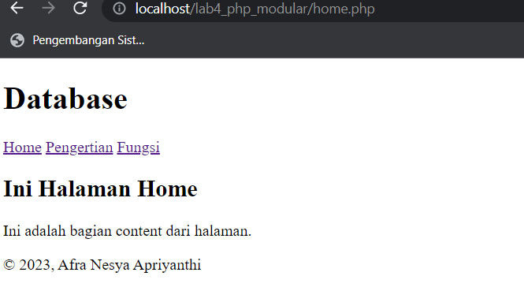
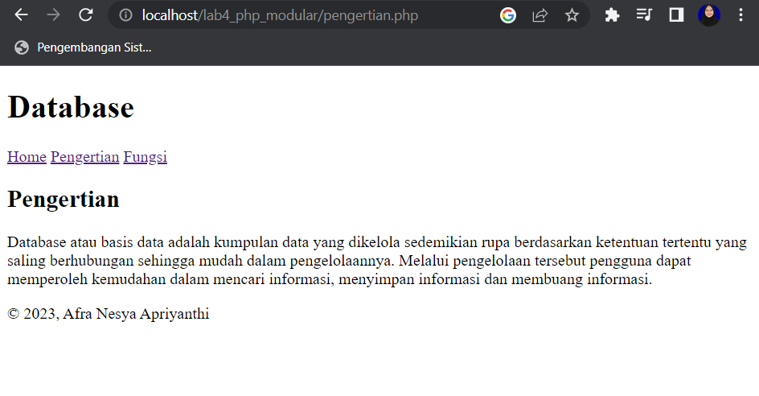
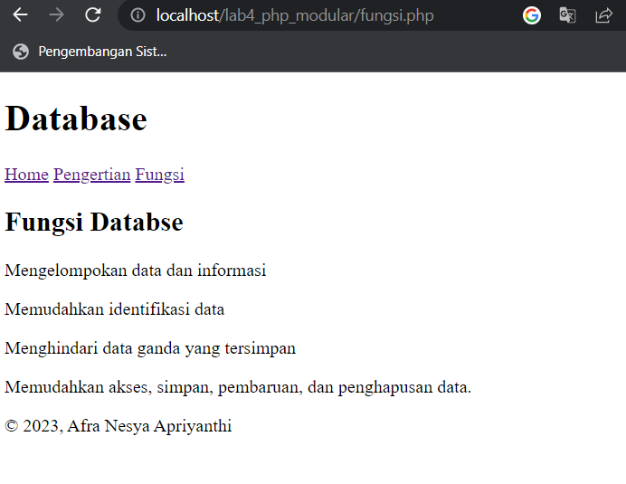

# Lab4Web
<p> Nama : Afra Nesya Apriyanthi <br> 
Nim : 312110614 <br> 
Kelas: TI.21.C1 <br> 
Mata Kuliah : Pemrograman Web 2 <br> 
Tugas Pertemuan 5 </p>


<p>Membuat folder baru dengan nama lab4_php_modular pada docroot webserver (htdocs) <p>


<p> header.php <p>

```php
<!DOCTYPE html> 
<html lang="en"> 
<head> 
	<meta charset="UTF-8"> 
	<title>Database</title> 
	<link href="style.css" rel="stylesheet" type="text/stylesheet" media="screen" /> 
</head> 
<body> 
	<div class="container"> 
		<header> 
			<h1>Database</h1> 
		</header> 
		<nav> 
			<a href="home.php">Home</a> 
			<a href="pengertian.php">Pengertian</a> 
			<a href="fungsi.php">Fungsi</a> 
		</nav>
```


<p> footer.php <p>

```php
		<footer> 
			<p>&copy; 2023, Afra Nesya Apriyanthi</p> 
		</footer> 
	</div> 
</body> 
</html>
```


<p> home.php <p>

```php
<?php require('header.php'); ?> 
<div class="content">
	<h2>Ini Halaman Home</h2> 
	<p>Ini adalah bagian content dari halaman.</p> 
</div> 

<?php require('footer.php'); ?>
```


<p> pengertian.php <p>

```php
<?php require('header.php'); ?> 

<div class="content"> 
	<h2>Pengertian</h2> 
	<p>Database atau basis data adalah kumpulan data yang dikelola sedemikian rupa berdasarkan ketentuan tertentu yang saling berhubungan sehingga mudah dalam pengelolaannya. Melalui pengelolaan tersebut pengguna dapat memperoleh kemudahan dalam mencari informasi, menyimpan informasi dan membuang informasi.</p> 
</div> 

<?php require('footer.php'); ?>
```


<p> fungsi.php <p>

```php
<?php require('header.php'); ?>
<div class="content">
    <h2>Fungsi Databse</h2>
    <p>Mengelompokan data dan informasi</p> 
    <p>Memudahkan identifikasi data</p>
    <p>Menghindari data ganda yang tersimpan</p> 
    <p>Memudahkan akses, simpan, pembaruan, dan penghapusan data.</p>
</div>
<?php require('footer.php'); ?>
```

<p> index.php <p>

```php
<?php 

$mod = @$_REQUEST['mod']; 

switch ($mod) { 
	case "home": 
	  require("home.php"); 
	  break; 
	case "pengertian": 
	  require("pengertian.php"); 
	  break;
	 case "fungsi": 
	  require("fungsi.php"); 
	  break; 
	default: 
	  require("home.php"); 
} 
?>
```

<p> .htaccess <p>

```php
<IfModule mod_rewrite.c> 
	RewriteEngine On 
	RewriteBase /lab4_php_modular/ 
	
	RewriteCond %{REQUEST_FILENAME} !-f 
	RewriteCond %{REQUEST_FILENAME} !-d 
	RewriteRule ^(.*)$ index.php?mod=$1 [L] 
</IfModule>
```

<p> Buka link http://localhost/lab4_php_modular/index.php <p>
<p> Maka hasilnya seperti berikut <p>



<p> Klik Pengertian <p>
<p> Maka hasilnya seperti berikut <p>



<p> Klik Fungsi <p>
<p> Maka hasilnya seperti berikut <p>


